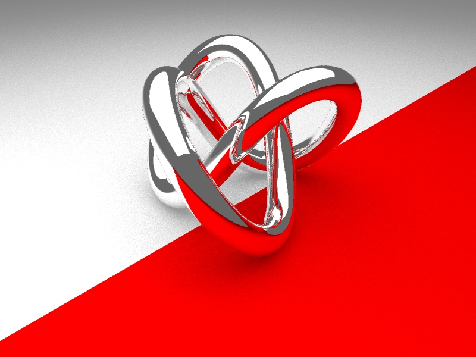
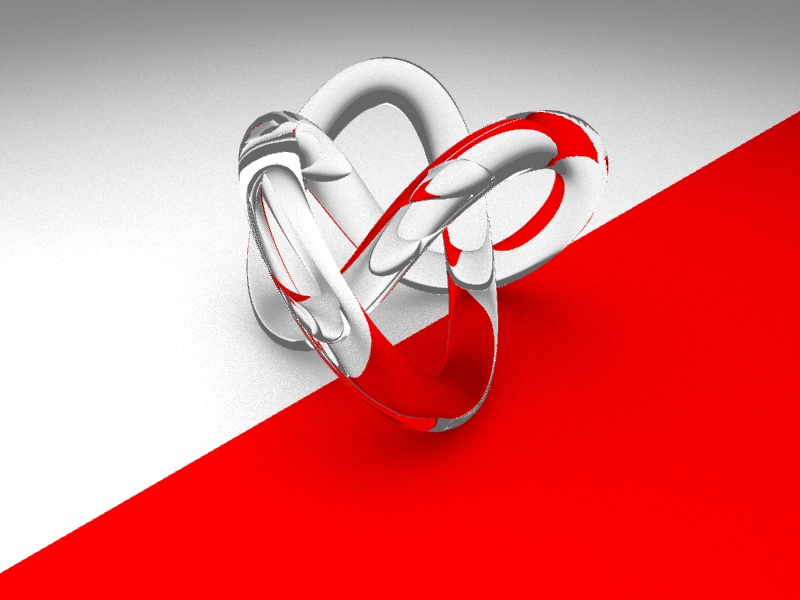
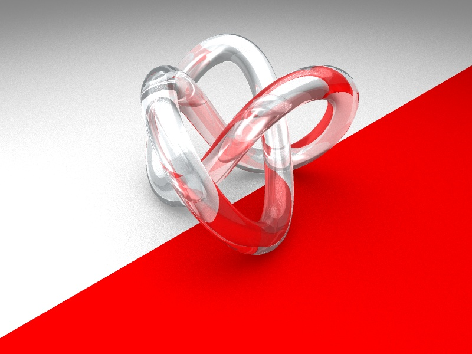

# Practical Assignment 5
**Name:** Miruna-Elena Petcan
## Problem 5.1 
### Reflection (Points 20)
In contrast to the rasterization algorithms, raytracing can simulate physically correct reflections and refractions. In this assignmnet we will extend the Phong shader to handle both reflections and refractions. 
Proceed as follows:
1. Fork the current repository.
2. Modify the README.md file in your fork and put your name (or names if you work in a group) above.
3. You will find the _torus knot_ model in your data folder.
4. Turn on BSP-support by enabling the flag `ENABLE_BSP` in types.h file or in cmake-gui.exe application.
5. Extend ```CShaderPhong::Shade()``` to also support reflections.
6. Test your implementation with torus knot.obj. 
If everything is correct your images should look like this:  
 

## Problem 5.2
### Refraction (Points 30)
Now we need to extend ```CShaderPhong::Shade()``` to also support refractions.
Test your implementation with torus knot.obj and refraction coefficient k = 1.5 (glass) or k = 2.4 (diamond)
If everything is correct your images should look like this:  
 

## Problem 5.3
### Glass Shading (Points 50)
In order to create the naturally-looking glass matherial, we need to combine reflections and refractions from the previouse problems. Please use the following proportions: 
- Ambient coefficient: 0
- Diffuse reflection coefficient: 0.1
- Specular refelection coefficient: 2
- Shininess exponent: 80
- Perfect reflection (mirror) coefficient: 0.2
- Perfect transmission coefficient: 0.8
- The refractive index of the medium: 1.5

Test your implementation on torus knot.obj. If everything is correct your image should look like this:
 
